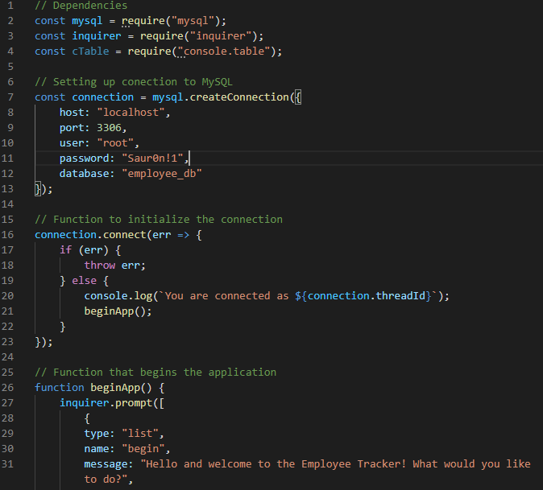
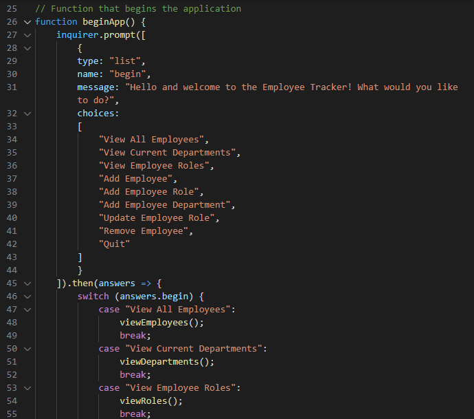
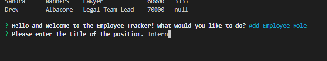
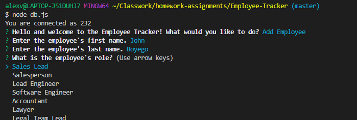
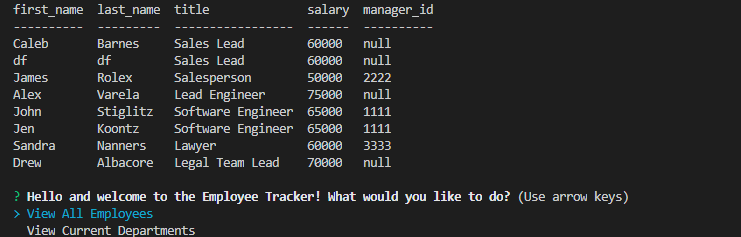
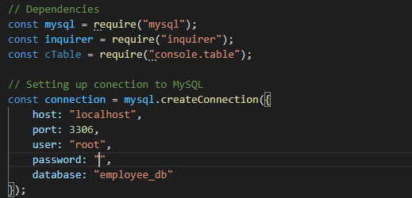

# Employee Tracker

## Description 

The employee tracker is an application designed to help employers add, update, and remove employees based on their name, role in the company, department, and more! The application uses a database from MySQL where it gets and stores all the data and is then manipulated through this application. 

## Table of Contents 

* [Description](#Description)
* [Installation](#Installation)
* [Usage](#Usage)
* [Credits](#Credits)
* [License](#License)
* [Contributions](#Contributions)
* [Tests](#Tests)
* [Questions](*Questions)

## Installation

In order to install the application, simply go to your node terminal, and type in "npm install" to install all the needed packages to make the app run.

## Usage

To use it, you can go to your terminal for node and type in "node db.js" and it will begin to ask you questions. You may manuever through the questions with the arrow keys on your keyboard.

As a note, make sure you set your password for the mysql.connection to your own personal password! This is essential in creating the connection to the database.

## Credits

Alex Varela (Me!)

## License

MIT

## Contributing

This code is open source and you may use it for any purposes you would like. Whether it is for your own education or just to get some coding ideas, it is all for you to use!

## Tests

No tests were created for this application.

## Questions

You may contact me through email or my GitHub!

Reach out to me!

Email: alexvar93@gmail.com
GitHub Profile: Fatmoogle || https://github.com/Fatmoogle 

---
© 2019 Trilogy Education Services, a 2U, Inc. brand. All Rights Reserved.

